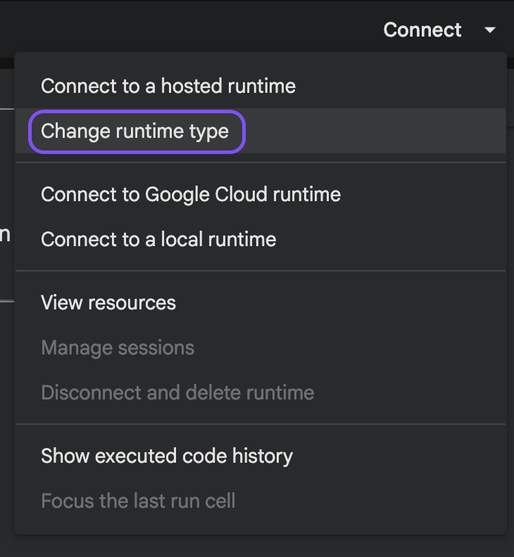
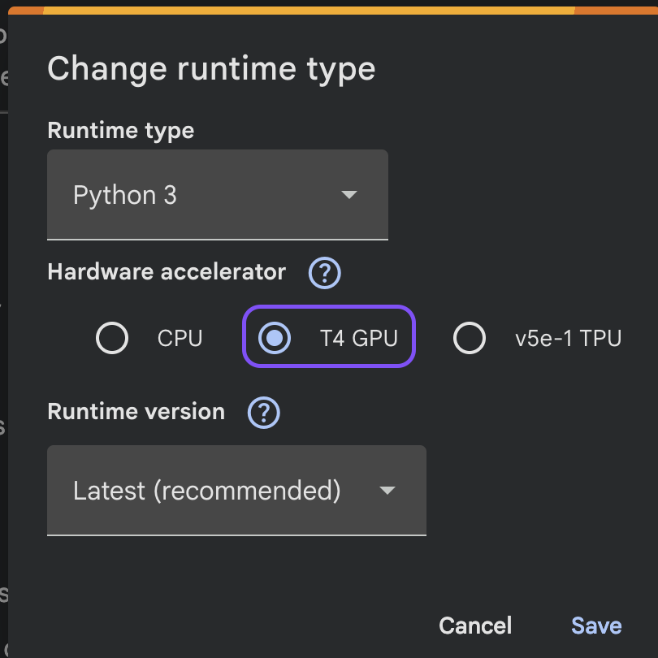
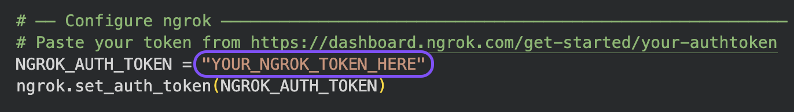
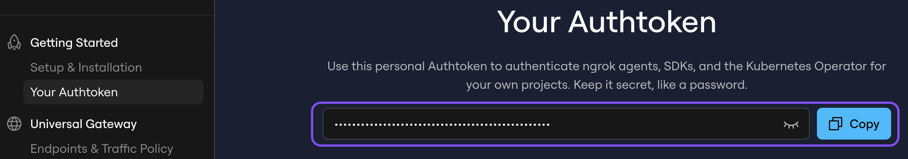

<p align="center">
  
</p>

# <p align="center">AmicoScript</p>

<p align="center"><strong>AmicoScript local audio transcription tool.</strong></p>

**AmicoScript** is a privacy-focused, local-first transcription tool built on OpenAI's Whisper models. It allows you to transform audio recordings into structured, searchable transcripts without your data ever leaving your repository or machine. Whether you need speaker identification (diarization), translation, or simple subtitles, AmicoScript provides a fast, free, and secure alternative to cloud services.


AmicoScript is perfect for journalists, researchers, students, or anyone who wants control over their audio data and transcripts. It supports batch processing, multiple export formats, and optional AI analysis features — all running locally on your hardware.

## ✨ Why AmicoScript

Most transcription tools:

- require uploading your audio to the cloud
- cost money or have limits
- don’t give you control over your data

AmicoScript keeps everything local.

→ Your audio never leaves your machine.

---

## 🚀 Features

- 🎧 Transcribe audio and video (MP3, WAV, M4A, OGG, FLAC, ACC, MP4, MOV, MKV)
- 📚 Batch process multiple files at once
- 🧠 Whisper models (tiny → large-v3)
- 🤖 AI analysis (summary, action items, translation, custom prompts)
- 🧠 LLM integration: configure local LLMs (Ollama or similar) from the UI
- 🗣️ Speaker diarization (who said what)
- 🌍 Real-time translation to English
- 🔍 Global search across transcripts
- 🗂️ Organize with folders and tags
- ✏️ Edit individual segments
- 📤 Export to JSON, SRT, TXT, Markdown
- ⌨️ Keyboard shortcuts for fast navigation
- 🚀 For Mac, Windows, Docker, or local Python

---

## ⚡ Example

Upload a meeting recording → get a structured, time-stamped transcript you can search, edit, and export.

---

## 🖥️ Quick Start

### Docker (recommended)

```bash
docker compose up --build
```

Then open: http://localhost:8002

#### Production deployment with HTTPS (Traefik)

If you're running behind a [Traefik](https://traefik.io/) reverse proxy, use the production override:

```bash
cp .env.example .env
# Edit .env and fill in APP_DOMAIN, TRAEFIK_NETWORK, TRAEFIK_CERTRESOLVER
docker compose -f docker-compose.yml -f docker-compose.prod.yml up -d
```

`docker-compose.prod.yml` adds Traefik labels and joins the Traefik Docker network. Traefik handles TLS termination and automatic Let's Encrypt certificates.

---

### Local

```bash
pip install -r backend/requirements.txt
python run.py
```

### macOS: Running unsigned apps (Not disabling Gatekeeper)

1. Download the latest release from the Releases page.
2. Because the app is not signed by Apple, macOS will initially block it. Open System Settings → Privacy & Security and enable "App Store and identified developers" (allow apps downloaded from App Store and identified developers).
3. Unzip the downloaded file. Double-click the application file (`AmicoScript.app`). macOS will prevent it from opening because it's from an unidentified developer.
4. In System Settings → Privacy & Security, click the "Open Anyway" button next to the blocked app, then confirm when prompted to allow the application to run.
5. The app will launch — you're ready to create icns files from PNG, JPG, or other image formats.


`run.py` will download `ffmpeg` automatically on first run.

---

## 🧪 Performance

Performance depends on your hardware (CPU/GPU) and selected model size.

- Larger models → better accuracy
- Smaller models → faster processing

Feedback and benchmarks are welcome.

For reproducible benchmarking instructions, see the [BENCHMARKS.md](BENCHMARKS.md) page.

---

## ☁️ Optional: Cloud Power (Google Colab)

If you don't have a powerful local GPU, you can offload the heavy transcription workload to Google Colab for free while keeping the application and your file library strictly local.

1. Toggle **Cloud Power** on in the sidebar.
2. Click **Open notebook in Colab ↗** — this opens the notebook directly in Google Colab without any manual upload.
3. In Colab, go to **Runtime > Change runtime type** and select **T4 GPU**.





4. Run **Cell 1** to install dependencies (~2–4 min).
5. Get your free [ngrok authtoken](https://dashboard.ngrok.com/get-started/your-authtoken), paste it into `NGROK_AUTH_TOKEN` in **Cell 2**, then run it.





6. Copy the generated `.ngrok-free.app` URL and paste it into the **Colab Bridge URL** field in AmicoScript.

> The ngrok URL changes every session — re-paste it each time you restart the notebook.

Your files will now be seamlessly processed on the cloud GPU, but saved and managed exclusively on your local machine!

---

## 🧩 Optional: Speaker Diarization

Uses `pyannote` and requires a Hugging Face token.

See full setup instructions in:
[Documentation](docs/doc.md)

## 🤖 AI Analysis & LLM

New in 1.4: AmicoScript can call a local LLM to produce analyses from transcripts — summaries, action-item extraction, full translations, or custom-prompt runs. Key notes:

- Configure the LLM base URL, model name, and optional API key from the app sidebar (`LLM Settings`). The default base URL is `http://localhost:11434` (Ollama-style API).
- You can test the connection from the UI or via the backend endpoint `POST /api/llm/test-connection`.
- List available models with `GET /api/llm/models` and trigger a model pull via `POST /api/llm/models/pull` (useful for Ollama pulls).
- Per-recording analyses are created with `POST /api/recordings/{recording_id}/analyses` and queried with `GET /api/recordings/{recording_id}/analyses`.

Docker tip: if your LLM runs outside the container, use `host.docker.internal` instead of `localhost` for the LLM base URL when running the app in Docker.

---

## 📚 Documentation

Full documentation (API, setup, details):

[Documentation](docs/doc.md)

---

## 🏗️ Architecture (brief)

- Backend: Python + FastAPI
- Frontend: Single HTML (no build step)
- Processing: Background jobs
- Storage: Temporary local files (auto-cleanup)

---

## 🤝 Contributing

Feedback, issues, and contributions are welcome.

---

## ⭐ If you find this useful

Give it a star — it helps a lot!

---

## ⚖️ License

This project is licensed under the **MIT License**. See the [LICENSE](LICENSE) file for more details.
