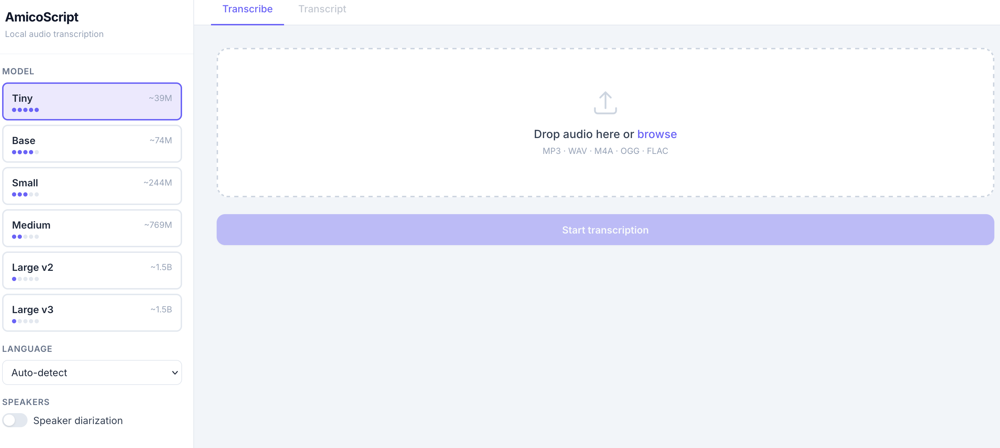

# AmicoScript

Local-first audio transcription with speaker identification. Upload a recording, get a time-stamped, searchable transcript — all processed on your machine, nothing sent to the cloud.

**Supports:** MP3, WAV, M4A, OGG, FLAC
**Models:** Whisper tiny → large-v3
**Export:** JSON, SRT, TXT, Markdown



---

## Quick start — Docker (recommended)

```bash
docker compose up --build
```

Open [http://localhost:8002](http://localhost:8002).

On first use, the selected Whisper model is downloaded automatically and cached in a Docker volume — subsequent runs are instant.

> **Frontend hot-reload:** The `frontend/` directory is mounted read-only into the container. Edit `index.html` and refresh the browser — no rebuild needed.

---

## Quick start — local

```bash
# Python 3.10+
pip install -r backend/requirements.txt
python run.py
```

`run.py` will automatically download the required `ffmpeg` executable for your operating system on first launch. The app runs at `http://localhost:8002`, and the browser will open automatically. The frontend is served directly by FastAPI from `frontend/index.html`.

---

## Using with venv (recommended for local development)

The project works great inside a Python virtual environment. The examples below create a `.venv` folder in the repository root.

- Windows (PowerShell):

```powershell
python -m venv .venv
.\.venv\Scripts\Activate.ps1
pip install -r backend/requirements.txt
python run.py
```

- macOS / Linux (bash/zsh):

```bash
python3 -m venv .venv
source .venv/bin/activate
pip install -r backend/requirements.txt
python run.py
```

If PowerShell blocks script execution when activating the virtual environment, you can enable local script execution for your user with:

```powershell
Set-ExecutionPolicy -Scope CurrentUser -ExecutionPolicy RemoteSigned -Force
```

Using a venv keeps dependencies isolated and matches how packaging and tests are performed in this repository.

---

## Standalone Executable (macOS / Windows)

You can build a standalone executable that doesn't require Docker or a Python environment using PyInstaller.

```bash
# Make sure you have the backend requirements and PyInstaller installed
cd backend
pip install -r requirements.txt
pip install pyinstaller
cd ..

# Run the packaging script
python package.py
```

This will create a `dist/AmicoScript` directory containing the compiled application. On macOS, it will also generate an `.app` bundle.

> **Note:** The standalone executable bundles the Python environment and its dependencies. On first launch, the app will automatically download the correct `ffmpeg` executable for the user's operating system (Windows, macOS, or Linux) directly next to the standalone executable, keeping the initial bundle size small and avoiding manual user installations.
>
> **Diarization packaging note:** speaker diarization in standalone builds requires `pyannote.audio` package data files (including telemetry config). The included packaging scripts already collect these files.

### Packaging from a virtual environment

If you prefer to build from an isolated `venv`, activate it and run the packaging script from the repository root. This ensures the bundled app uses the same dependency set you tested locally.

- Windows (PowerShell):

```powershell
python -m venv .venv
.\.venv\Scripts\Activate.ps1
pip install -r backend/requirements.txt
pip install pyinstaller
.venv\Scripts\python.exe package.py
```

- macOS / Linux (bash/zsh):

```bash
python3 -m venv .venv
source .venv/bin/activate
pip install -r backend/requirements.txt
pip install pyinstaller
python package.py
```

Note: On Windows make sure no running `AmicoScript.exe` is locking files in `dist/AmicoScript` when packaging; close any running app before rebuilding.

---

## Speaker diarization (optional)

Speaker identification uses the [pyannote](https://github.com/pyannote/pyannote-audio) pipeline, which requires a free Hugging Face account and accepting two model licenses.

### Step 1 — Create a Hugging Face account

Go to [huggingface.co/join](https://huggingface.co/join) and sign up (or log in if you already have an account).

### Step 2 — Accept the model licenses

You must accept the terms on **both** of these model pages (they are gated models):

1. **Speaker Diarization pipeline** — [pyannote/speaker-diarization-3.1](https://huggingface.co/pyannote/speaker-diarization-3.1)
   - Open the link and scroll down to the gated access form
   - Check both checkboxes (share contact info + agree to license)
   - Click **"Agree and access repository"**

2. **Segmentation model** (required dependency) — [pyannote/segmentation-3.0](https://huggingface.co/pyannote/segmentation-3.0)
   - Same process: open the link, check the boxes, click **"Agree and access repository"**

> **Note:** If you skip either license, you will get a `403 Client Error: Cannot access gated repo` error when trying to diarize.

### Step 3 — Create an access token

1. Go to [huggingface.co/settings/tokens](https://huggingface.co/settings/tokens)
2. Click **"Create new token"**
3. Give it a name (e.g. `amicoscript`)
4. Select the **"Read"** role (that's all that's needed)
5. Click **"Create token"**
6. Copy the token — it starts with `hf_`

### Step 4 — Paste the token in AmicoScript

1. In the AmicoScript sidebar, toggle **"Speaker diarization"** on
2. Paste your `hf_` token into the **HuggingFace Token** field
3. The token is saved automatically — it persists across restarts in `~/.amicoscript/settings.json` and never leaves your machine

### Troubleshooting diarization in standalone builds

- Error: `No such file or directory: ... pyannote/audio/telemetry/config.yaml`
  - Cause: missing `pyannote.audio` package data in the bundle.
  - Fix: rebuild using `python package.py` from the repository root.

- Error: `Transcription error: 'NoneType' object has no attribute 'write'`
  - Cause: windowed (`--noconsole`) process started without attached stdio streams.
  - Fix: use the current build scripts/codebase (includes stdio fallback guards) and rebuild.

- Packaging cleanup fails with `Access is denied` in `dist/AmicoScript`
  - Cause: previous `AmicoScript.exe` still running and locking files.
  - Fix: close/kill the running app process, then run packaging again.

---

## API reference

| Method | Path                          | Description                                      |
| ------ | ----------------------------- | ------------------------------------------------ |
| `GET`  | `/api/models`                 | Available Whisper models                         |
| `GET`  | `/api/settings`               | Get saved settings (HF token)                    |
| `POST` | `/api/settings`               | Save settings (HF token persisted to disk)       |
| `POST` | `/api/transcribe`             | Upload file, start job → `{job_id}`              |
| `GET`  | `/api/jobs/{id}/stream`       | SSE progress stream                              |
| `POST` | `/api/jobs/{id}/cancel`       | Cancel running job                               |
| `GET`  | `/api/audio/{id}`             | Raw audio (for in-browser player)                |
| `GET`  | `/api/jobs/{id}/result`       | Full JSON result                                 |
| `GET`  | `/api/jobs/{id}/export/{fmt}` | Download transcript (`json`, `srt`, `txt`, `md`) |

---

## Architecture

- **Backend:** Python + FastAPI. Each transcription runs in a background thread (not async) because `faster-whisper` and `pyannote` are blocking C/torch operations. Progress events flow via a per-job `asyncio.Queue` to the SSE endpoint.
- **Frontend:** Single `index.html` — Tailwind CSS (CDN), vanilla JS, no build step.
- **Storage:** No database. All job state lives in-memory; audio files are cleaned up after 1 hour.
- **Performance:** `int8` quantization on CPU gives 2-4× speedup over `float32` with minimal accuracy loss.

---

## GPU acceleration

The Docker image uses CPU by default. For GPU, switch the base image in `Dockerfile`:

```dockerfile
FROM pytorch/pytorch:2.3.0-cuda12.1-cudnn8-runtime
```

And ensure [nvidia-container-toolkit](https://docs.nvidia.com/datacenter/cloud-native/container-toolkit/install-guide.html) is installed, then add to `docker-compose.yml`:

```yaml
deploy:
  resources:
    reservations:
      devices:
        - driver: nvidia
          count: 1
          capabilities: [gpu]
```
