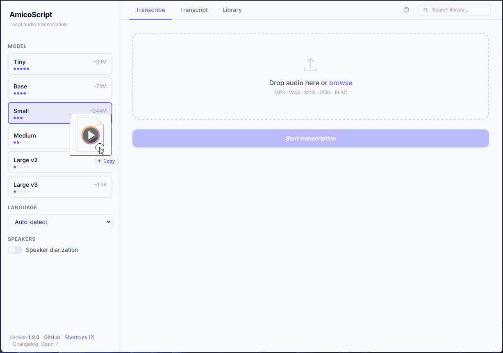

# AmicoScript — Local Audio Transcription Tool



Turn audio recordings into searchable transcripts — fully local, no cloud, no data leaks.

AmicoScript is a local-first transcription tool built on Whisper.  
Upload an audio file and get a time-stamped transcript with optional speaker identification — all processed on your machine.

---

## ✨ Why AmicoScript

Most transcription tools:

- require uploading your audio to the cloud
- cost money or have limits
- don’t give you control over your data

AmicoScript keeps everything local.

→ Your audio never leaves your machine.

---

## 🚀 Features

- 🎧 Transcribe audio (MP3, WAV, M4A, OGG, FLAC, ACC)
- 🧠 Whisper models (tiny → large-v3)
- 🗣️ Speaker diarization (who said what)
- 🌍 Real-time translation to English
- 🔍 Global search across transcripts
- 🗂️ Organize with folders and tags
- ✏️ Edit individual segments
- 📤 Export to JSON, SRT, TXT, Markdown
- ⌨️ Keyboard shortcuts for fast navigation

---

## ⚡ Example

Upload a meeting recording → get a structured, time-stamped transcript you can search, edit, and export.

---

## 🖥️ Quick Start

### Docker (recommended)

```bash
docker compose up --build
```

Then open: http://localhost:8002

---

### Local

```bash
pip install -r backend/requirements.txt
python run.py
```

`run.py` will download `ffmpeg` automatically on first run.

---

## 🧪 Performance

Performance depends on your hardware (CPU/GPU) and selected model size.

- Larger models → better accuracy
- Smaller models → faster processing

Feedback and benchmarks are welcome.

---

## 🧩 Optional: Speaker Diarization

Uses `pyannote` and requires a Hugging Face token.

See full setup instructions in:
docs/doc.md

---

## 📚 Documentation

Full documentation (API, setup, details):

[Documentation](docs/doc.md)

---

## 🏗️ Architecture (brief)

- Backend: Python + FastAPI
- Frontend: Single HTML (no build step)
- Processing: Background jobs
- Storage: Temporary local files (auto-cleanup)

---

## 🤝 Contributing

Feedback, issues, and contributions are welcome.

---

## ⭐ If you find this useful

Give it a star — it helps a lot!
